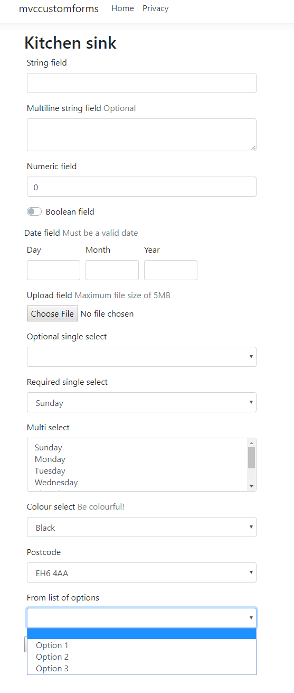

# Storm.Formification

This repo contains prototype code that is designed as the basis of a code-first form building library that can be used to rapidly create data entry forms with rich validation and presentation logic

# Initialisation

The form builder library is supplied as a separate package that contains code and custom razor views and templates.  To use the package include it via NuGet (when it is available).

```
Install-Package Storm.Formification.Core
```

Then add the configuration step to your MVC configuration like so:

```c#
    services.AddMvc()
        // ------
        .ConfigureForms(typeof(Startup).Assembly) // specify each assembly that contains form models
        .EnableFormsController(typeof(Startup).Assembly) // optionally generates a Controller for each form under /forms/<form-slug>
        // ------
        .SetCompatibilityVersion(CompatibilityVersion.Version_2_2);
```

# Form component templates

```
Install-Package Storm.Formification.Bootstrap4
```

This will install the Bootstrap4 component templates

# A Form

A form is built by creating a POCO (plain old CLR object) and decorating it with attributes that provide functional definition or presentational definition to the rendered form.  Each attribute will be described briefly below, here is an example "form".

```c#
    [Info("Kitchen sink")]
    public class KitchenSink
    {
        // Simple, single line text box
        [Text]
        public string StringField { get; set; }

        // Multi-line text box
        [MultilineText]
        [HintLabel("Optional")] // "hint text" can be rendered via a TagHelper within a component view
        public string MultilineStringField { get; set; }

        // Renders as a HTML5 number field
        [Numeric]
        public int NumericField { get; set; }

        // A boolean (Yes/No) checkbox
        [Boolean]
        public bool BooleanField { get; set; }

        [Date]
        [HintLabel("Must be a valid date")]
        public DateTime DateField { get; set; }

        [Date]
        [HintLabel("Optional date that can be empty")]
        public DateTime? DateField { get; set; }

        // Presents a basic file upload input
        [Upload]
        [HintLabel("Maximum file size of 5MB")]
        public IFormFile UploadField { get; set; }

        // A "Choice" presents a list of possible values and text labels, the presentation depends on the type definition

        // A nullable type will present all available options along with a default "empty" option
        [Choice]
        public DayOfWeek? OptionalSingleSelect { get; set; }

        // Using an Enum type like `DayOfWeek` will render each item from the Enum
        [Choice]
        public DayOfWeek RequiredSingleSelect { get; set; }

        // Using an Enumerable type will present a multi-select box where more than 1 item can be selected
        [Choice]
        public IEnumerable<DayOfWeek> MultiSelect { get; set; }

        [Choice]
        [HintLabel("Be colourful!")]
        public ConsoleColor ColourSelect { get; set; }

        // The `ChoiceDataSource` allows dynamic values to be presented for a given choice field, see examples below

        [Choice]
        [ChoiceDataSource(typeof(ListOfPostcodesDataSource))]
        public string Postcode { get; set; }

        [Choice]
        [ChoiceDataSource(typeof(ListOfOptionsDataSource))]
        public int? FromListOfOptions { get; set; }
    }

    ///
    /// <summary>Creates a simple list of choices</summary>
    ///
    public class ListOfOptionsDataSource : IChoiceDataSource
    {
        public async Task<IEnumerable<ChoiceItem>> GetAsync()
        {
            return await Task.FromResult(new List<ChoiceItem> { 
                new ChoiceItem("1", "Option 1"), 
                new ChoiceItem("2", "Option 2"), 
                new ChoiceItem("3", "Option 3"), 
            });
        }
    }

    ///
    /// <summary>Dynamically retrieves a list of postcodes to present as choices</summary>
    ///
    public class ListOfPostcodesDataSource : IChoiceDataSource
    {
        private readonly string postcode;
        private readonly HttpClient client;

        public ListOfPostcodesDataSource(IHttpClientFactory httpClientFactory)
        {
            postcode = "eh6";
            client = httpClientFactory.CreateClient();
        }

        public async Task<IEnumerable<ChoiceItem>> GetAsync()
        {
            try
            {
                var data = await client.GetStringAsync($"https://api.postcodes.io/postcodes?q={postcode}&limit=100");
                var result = JsonConvert.DeserializeObject<Root>(data);
                if (result.status == 200)
                {
                    return result.result.Select(c => new ChoiceItem(c.postcode, c.postcode));
                }
            }
            catch
            {
                // argh, testing!
            }

            return Enumerable.Empty<ChoiceItem>();
        }

        public class Root
        {
            public int status { get; set; }
            public Result[] result { get; set; }
        }

        public class Result
        {
            public string postcode { get; set; }
            public string nhs_ha { get; set; }
            public string primary_care_trust { get; set; }

        }
    }    
```

## Example form layout


